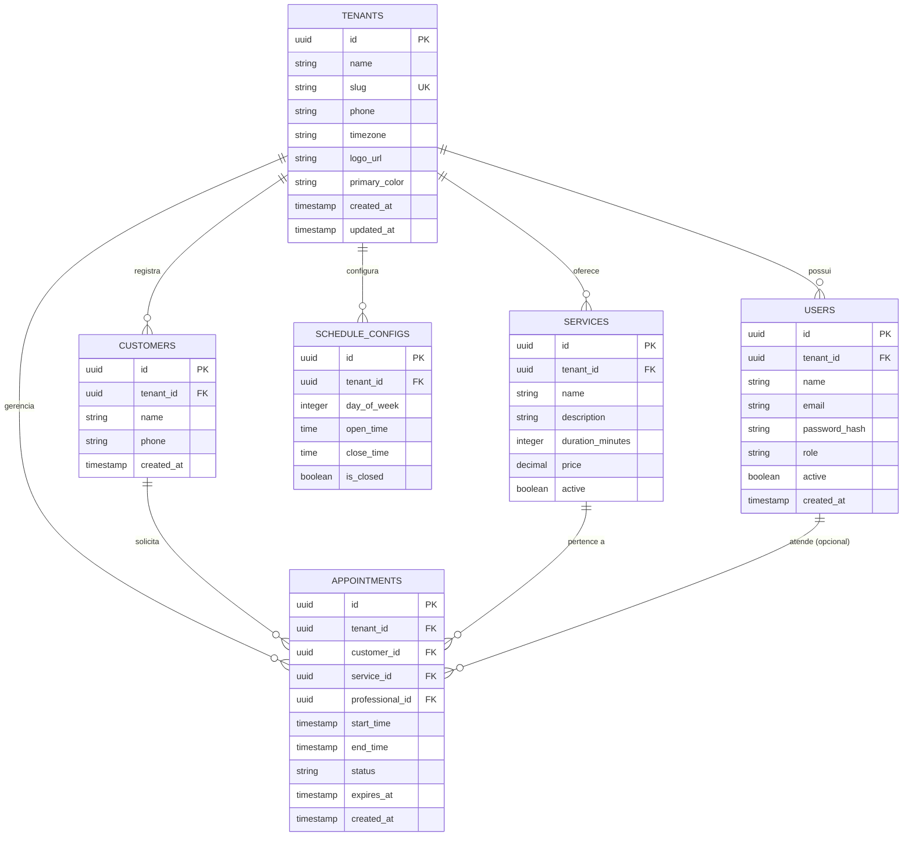
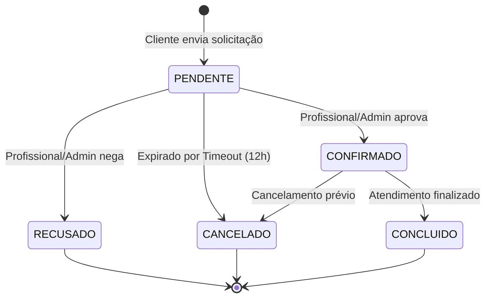

# 🗄️ Modelagem de Banco de Dados e Diagramas UML — StudioFy

Este documento contém a modelagem conceitual e lógica do banco de dados relacional PostgreSQL do **StudioFy**, bem como os diagramas UML que orientam as regras de segurança e transição de estados.

---

## 📊 1. Diagrama Entidade-Relacionamento (ERD)

O diagrama abaixo representa a estrutura de tabelas, tipos de dados e relacionamentos com isolamento Multi-tenant via `tenant_id`.

---

## 🔄 2. Diagrama UML de Estados (Ciclo de Vida do Agendamento)

Abaixo é apresentado o modelo UML de máquina de estados para controle rigoroso das transições de um agendamento na camada de domínio.

---

## 🔐 3. Dicionário de Dados & Estratégia de Isolamento (RLS)

### Regra de Segurança Multi-Tenant (Row Level Security)

- **Chave Discriminadora:** Toda tabela (exceto `tenants`) contém a coluna `tenant_id` como Chave Estrangeira com restrição `ON DELETE CASCADE`.
- **Políticas do Postgres (RLS):** As consultas utilizam a variável de sessão `app.current_tenant_id` configurada pela conexão transacional (`withTenant`).
- **Regra de Isolamento:**

$$\text{Acesso Autorizado} \iff \text{linha.tenant\_id} = \text{current\_setting('app.current\_tenant\_id')}$$
